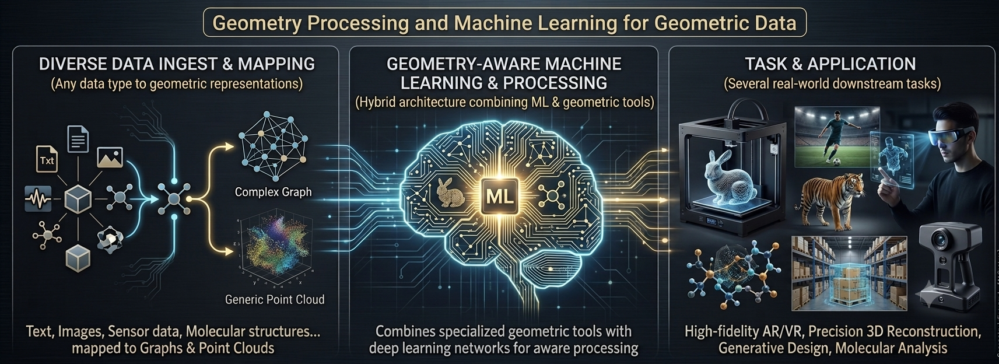

# GeoProML4GeoData

This is the Repository for the course Geometry Processing and Machine Learning for Geometric Data, yields at the University of Milano - Bicocca, in July 2026.

**Lecturers:** Simone Melzi [website](https://sites.google.com/site/melzismn/)

**Where:**
Aula Seminari, First or third floor, Building U14, Viale Sarca 336, 20125, Milan (Italy)
Department of Informatics, Systems and Communication (DISCo)
University of Milan-Bicocca

**When: (attempt)** 

      Thursday 9/07/2026    14.00 - 18.00    U244 C02

      Monday  13/07/2026   14.00 - 18.00    U14 T023

      Tuesday  14/07/2026    9.30 - 13.30    U14 T023
      
      Thursday  16/07/2026    14.00 - 18.00    U14 T023

      Thursday  23/07/2026    9.30 - 13.30    U14 T023

**Programme and resources:** 

**Date** | **Slot** | **Topic** | **Code & Data** | **slides**
------------ | ------------- | ------------ | ------------ | -------------
| | |
Thu 9 Jul | 14.00 - 16.00 | Introduction to 3D data |  | |
| | |
Thu 9 Jul | 16.00 - 18.00 |  LAB0 + 3D Applications | [LAB0](https://colab.research.google.com/drive/15MepjZaC3mMlNkgtslq67FvMP2zIFTpV?usp=sharing) |  |
| | |
Mon 13 Jul | 14.00 - 16.00 |  Spectral representation | [LAB0.5](https://drive.google.com/file/d/1R_xDJEHI9kxyj3KAExuz2R_Q1neTFTat/view?usp=sharing) |  |
| | |
Mon 13 Jul | 16.00 - 18.00 | LAB1 spectral | [LAB1](https://github.com/3diglab/geomfum)|  |
| | |
Tue 14 Jul | 9.30 - 11.30 | Point based architectures |  |  |
| | |
Tue 14 Jul | 11.30 - 13.30 | LAB2 - Point-based | [LAB2](https://colab.research.google.com/drive/175CjAaoa62DySzsNynNqbQFIAlhDaXHR?usp=sharing) |  |
| | |
Thu 16 Jul | 14.00 - 16.00 | GNN and Transformers architectures  |  |  |
| | |
Thu 16 Jul | 16.00 - 18.00 | LAB3 - GNN and Transformers  |  |  |
| | |
Thu 23 Jul | 9.30 - 11.30 | Project finalization |  |
| | |
Thu 23 Jul | 11.30 - 13.30 | Project discussion |  |  |
| | |

